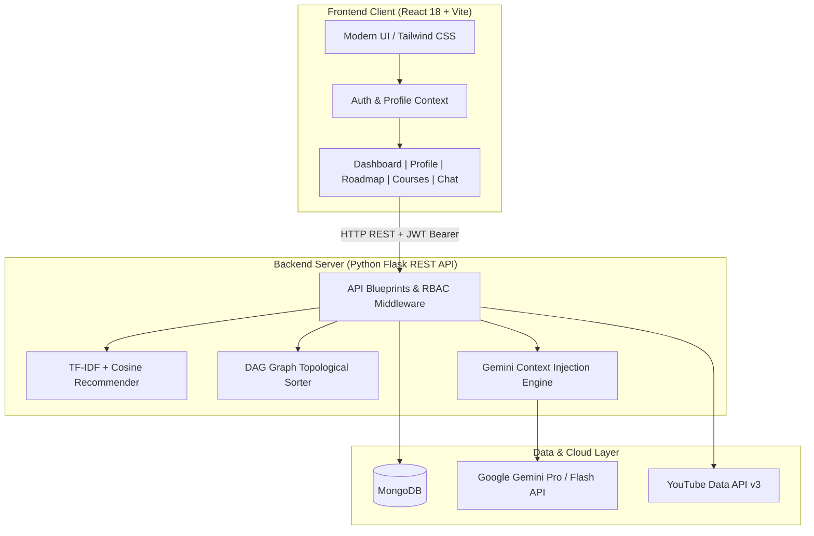

# 🧭 Pathfinder (The GenZ)
### *AI-Powered Personalized Learning Path Recommender*

[](https://www.python.org/)
[](https://react.dev/)
[](https://vitejs.dev/)
[](https://www.mongodb.com/)
[](https://ai.google.dev/)
[](https://tailwindcss.com/)

> **Submission for the HCL Hackathon**  
> **Theme:** AI-Powered Personalized Learning Path Recommender

---

## 💡 The Problem We Set Out to Solve

If you’ve ever tried learning a new technical discipline online — whether that's Machine Learning, Full-Stack Engineering, or Cloud DevOps — you've probably hit the dreaded **"tutorial hell"**.

Current learning platforms present thousands of isolated courses in flat catalogs. While search filters exist, self-directed learners face three core problems:
1. **Sequencing Chaos:** Knowing *what* you want to become (e.g., "Full-Stack AI Engineer") doesn't tell you *the exact order* of concepts to learn. Beginners often dive straight into complex frameworks before mastering foundational prerequisites.
2. **Analysis Paralysis & Resource Sprawl:** Sifting through endless video playlists and fragmented tutorials without knowing if they meet industry requirements leads to wasted time and duplicate efforts.
3. **The Mentorship Void:** 1-on-1 human coaching is scarce and expensive. When learners get stuck on a tricky concept in their roadmap, they lack immediate, contextual guidance.

**Pathfinder** bridges this gap. It acts as an intelligent, personalized career navigation engine that analyzes a learner's baseline skills and career aspirations, constructs a mathematically ordered **prerequisite graph (DAG)** roadmap, matches targeted courses and YouTube playlists, and pairs them with a **context-aware AI mentor** powered by Google Gemini.

---

## ✨ Key Features

### 🎯 1. Dynamic Learner Profiling & Skill Gap Analysis
- Captures career targets, current technical proficiencies, experience levels, and weekly time commitments.
- Evaluates the mathematical delta between what a learner already knows and what industry roles require.

### 🗺️ 2. Prerequisite-Aware Roadmap Generator (DAG Topological Sort)
- Rather than presenting a flat list of recommendations, Pathfinder models topics as a **Directed Acyclic Graph (DAG)**.
- Runs **Topological Sorting** algorithms to ensure foundational concepts (e.g., JavaScript basics, HTML/CSS) strictly precede advanced topics (e.g., React, Next.js, State Management).
- Breaks study plans into progressive, digestible phases with actionable milestone projects.

### 🤖 3. 24/7 Context-Aware AI Mentor (Google Gemini)
- Integrated conversational assistant powered by **Google Gemini LLM**.
- Unlike generic chatbots, Pathfinder injects the learner's active profile and current roadmap phase into the prompt context, providing deeply relevant, phase-specific mentorship and explanations.

### 🔍 4. Multi-Signal Content Recommender
- Uses **TF-IDF Vectorization** and **Cosine Similarity** to match learner profiles and goals against available catalog courses.
- Factors in skill overlap, difficulty calibration, and career goal alignment.

### 📺 5. Automated Multimedia Discovery (YouTube Data API v3)
- Dynamically searches, filters, and binds curated instructional YouTube playlists directly to corresponding roadmap milestones.

### 📊 6. Interactive Learner Dashboard & Progress Tracker
- Real-time visibility into overall progress, completed milestone phases, active learning objectives, and recommended next actions.

### 🛡️ 7. Role-Based Access Control (RBAC) & Security
- Secure token-based authentication (**JWT HMAC-SHA256**) with protected frontend routes and backend decorators.
- Distinct workflows and portals for **Learners**, **Content Managers** (curating catalog courses), and **Platform Admins**.

---

## 🏗️ System Architecture & Workflow

Pathfinder is built on a clean, decoupled client-server architecture:



### End-to-End User Flow
1. **Onboarding & Profile Intake:** Learner signs up and defines career target (e.g. *Data Scientist*), existing skills, and weekly availability.
2. **Graph Construction & Roadmap Synthesis:** The engine extracts required competencies, computes topological dependencies, and outputs structured milestones.
3. **Enrichment:** Roadmap phases are enriched with high-relevance internal courses and external YouTube playlists.
4. **Interactive Mentorship & Tracking:** The learner tracks milestone completions while consulting the contextual Gemini AI mentor whenever they hit roadblocks.

---

## 🛠️ Technology Stack

| Layer | Technology | Purpose |
|---|---|---|
| **Frontend UI** | **React 18.x**, **Vite 5.x** | Fast, responsive Single Page Application with Hot Module Replacement |
| **Styling & Icons** | **Tailwind CSS v4**, **Lucide React** | Clean, modern, accessible responsive UI design |
| **Client Routing & State** | **React Router v7**, **Context API** | Protected routes, role guards, and global authentication state |
| **Backend Runtime** | **Python 3.10+**, **Flask 3.x** | Modular RESTful API with blueprint architecture |
| **Security & Auth** | **Flask-JWT-Extended**, **Bcrypt** | Stateless token authentication & password hashing |
| **AI / NLP & LLM** | **Google Gemini (`google-genai`)** | Conversational AI mentor with contextual system prompting |
| **Graph & ML Algorithms** | **Scikit-learn**, **Custom DAG Sorter** | TF-IDF, Cosine Similarity scoring, and Topological Graph resolution |
| **External Media** | **YouTube Data Discovery API v3** | Automated instructional playlist curation |
| **Database** | **MongoDB (PyMongo)** | Flexible schema persistence for profiles, courses, and roadmaps |

---

## 📂 Project Structure

```text
Pathfinder-The-Genz/
├── client/                     # Frontend React SPA
│   ├── public/                 # Static web assets
│   ├── src/
│   │   ├── api/                # Axios instance & JWT interceptors (api.js)
│   │   ├── components/         # Shared UI components, layout, navbar
│   │   ├── context/            # Global AuthContext & state management
│   │   ├── routes/             # AppRoutes, ProtectedRoute & RoleRoute
│   │   ├── views/
│   │   │   ├── auth/           # Login & Registration views
│   │   │   ├── chat/           # Gemini AI Mentorship Chat interface
│   │   │   ├── courses/        # Course catalog & course details
│   │   │   ├── dashboard/      # Learner, Admin & Content Manager dashboards
│   │   │   ├── profile/        # Learner profile & skill management
│   │   │   ├── progress/       # Milestone & progress tracking views
│   │   │   └── roadmap/        # Visual interactive learning roadmap
│   │   ├── App.jsx             # Root application component
│   │   └── main.jsx            # Vite entry point
│   ├── package.json
│   └── vite.config.js
│
├── server/                     # Backend Python Flask API
│   ├── app/
│   │   ├── ai/                 # Core AI, NLP & Recommendation modules
│   │   │   ├── llm/            # Gemini client & prompt templates
│   │   │   ├── nlp/            # Skill & goal extraction utilities
│   │   │   ├── recommendation/ # TF-IDF & Cosine Similarity ranking
│   │   │   └── roadmap/        # Prerequisite graph & DAG topological sorter
│   │   ├── config/             # App config & MongoDB database connection
│   │   ├── controllers/        # Request handlers (auth, roadmap, chat, etc.)
│   │   ├── data/               # Seed datasets (courses.json, skills.json)
│   │   ├── middleware/         # Auth verification & RBAC role guards
│   │   ├── models/             # Entity models & database schemas
│   │   ├── routes/             # Flask Blueprints (auth, users, roadmap, etc.)
│   │   └── services/           # Business logic (Gemini, YouTube, Roadmap, etc.)
│   ├── scripts/                # Database bootstrap & admin creation scripts
│   │   ├── create_admin.py     # Default admin account generator
│   │   ├── seed_courses.py     # Course catalog seed script
│   │   ├── seed_skills.py      # Skill taxonomies seed script
│   │   └── seed_prerequisites.py # DAG prerequisite dependencies
│   ├── main.py                 # Server entry point (Port 5002)
│   ├── requirements.txt        # Python backend dependencies
│   └── .env.example            # Environment variable template
│
├── .env.example                # Root environment template
├── Pathfinder Technical Documentation.pdf # Full architectural documentation
└── README.md                   # Project documentation
```

---

## 🚀 Getting Started & Local Setup

Follow these steps to run Pathfinder on your local development machine.

### Prerequisites
Make sure you have installed:
- **Node.js** (v18.x or higher) & **npm**
- **Python** (v3.10 or higher)
- **MongoDB** (running locally on port 27017, or a MongoDB Atlas URI)
- *(Optional but recommended)* A free **Google Gemini API Key** from [Google AI Studio](https://aistudio.google.com/) and a **YouTube Data API Key** from Google Cloud Console.

---

### Step 1: Clone the Repository
```bash
git clone https://github.com/exoticcgirish/Pathfinder-The-Genz.git
cd Pathfinder-The-Genz
```

---

### Step 2: Configure Environment Variables

Create your `.env` file in the `server` directory (or copy from `.env.example`):

```bash
# On Linux/macOS:
cp .env.example server/.env

# On Windows (PowerShell):
copy .env.example server\.env
```

Open `server/.env` and configure your keys:
```env
FLASK_ENV=development
PORT=5002

# MongoDB Connection
MONGO_URI=mongodb://localhost:27017/pathfinder_db
DB_NAME=pathfinder_db

# Security
JWT_SECRET_KEY=pathfinder_super_secret_jwt_key_2026

# External AI & Media APIs
GEMINI_API_KEY=your_gemini_api_key_here
YOUTUBE_API_KEY=your_youtube_api_key_here
```

> **Note:** Even without API keys configured, the application includes robust fallback generators for roadmaps and course recommendations so you can explore the entire UI flow immediately.

---

### Step 3: Set Up & Run the Backend Server

1. Navigate to the `server` folder:
   ```bash
   cd server
   ```

2. Create and activate a Python virtual environment:
   ```bash
   # Linux/macOS:
   python3 -m venv venv
   source venv/bin/activate

   # Windows (PowerShell):
   python -m venv venv
   .\venv\Scripts\Activate.ps1
   ```

3. Install backend dependencies:
   ```bash
   pip install -r requirements.txt
   ```

4. Seed the database with sample courses, skills, and admin accounts:
   ```bash
   python app/data/seed_courses.py
   python scripts/create_admin.py
   ```

5. Start the Flask server:
   ```bash
   python main.py
   ```
   *The backend will boot up at `http://localhost:5002` (or `http://127.0.0.1:5002`).*

---

### Step 4: Set Up & Run the Frontend Client

1. Open a new terminal tab and navigate to the `client` folder:
   ```bash
   cd client
   ```

2. Install frontend dependencies:
   ```bash
   npm install
   ```

3. Start the Vite development server:
   ```bash
   npm run dev
   ```
   *The frontend client will launch at `http://localhost:5173`.*

---

## 🔑 Demo & Testing Credentials

You can test the application using either a pre-seeded account or by creating a fresh learner profile:

| Role | Email | Password | Access / Capabilities |
|---|---|---|---|
| **Platform Admin** | `admin@pathfinder.com` | `Admin@123` | Full access to Admin metrics, user oversight, and content tools |
| **Learner (New)** | *Register via UI* | *Your choice* | Complete personalized onboarding, roadmap generation, and AI chat |

---

## 📡 REST API Reference

All protected endpoints require an `Authorization: Bearer <token>` header obtained from the login endpoint.

| Method | Endpoint | Access | Description |
|---|---|---|---|
| `POST` | `/api/auth/register` | Public | Create new student/user account & receive JWT |
| `POST` | `/api/auth/login` | Public | Authenticate user credentials & receive JWT |
| `GET` | `/api/auth/me` | Authenticated | Fetch authenticated user profile & role |
| `GET` | `/api/users/profile` | Authenticated | Retrieve learner career goals, skills & preferences |
| `PUT` | `/api/users/profile` | Authenticated | Update learner profile (triggers roadmap re-calculation) |
| `GET` | `/api/courses` | Authenticated | Fetch filtered/paginated course catalog |
| `POST` | `/api/courses` | Admin / Manager | Add new course syllabus to catalog |
| `DELETE` | `/api/courses/:id` | Admin / Manager | Delete course from catalog |
| `GET` | `/api/roadmap` | Authenticated | Get current active visual roadmap |
| `POST` | `/api/roadmap/generate` | Authenticated | Generate new DAG-sorted roadmap based on profile |
| `POST` | `/api/chat/message` | Authenticated | Send prompt to Gemini AI mentor with injected context |
| `GET` | `/api/progress` | Authenticated | Fetch user milestone & course progress |
| `POST` | `/api/progress/phase/complete` | Authenticated | Mark roadmap phase as complete & update stats |

---

## 📋 Hackathon Deliverables Checklist

- [x] **Source Code (ZIP / Git):** Decoupled, production-ready React 18 SPA + Python Flask backend.
- [x] **Source Code Repository:** Publicly available on GitHub with structured commit history.
- [x] **Solution Documentation:** Comprehensive technical reference available in [`Pathfinder Technical Documentation.pdf`](./Pathfinder%20Technical%20Documentation.pdf).
- [x] **AI/ML Engine:** Implemented DAG Topological Sorting, TF-IDF + Cosine Similarity matching, and Google Gemini context-injected conversational mentorship.
- [x] **Local Setup Guide:** Complete, tested step-by-step instructions provided in this README and `.env.example`.

---

## 👥 Team & Acknowledgements

Developed with ❤️ for the **HCL Hackathon**.  
Special thanks to the open-source community, Google DeepMind / Google AI Studio for Gemini LLM capabilities, and the HCL evaluation jury for the opportunity to present **Pathfinder**.
